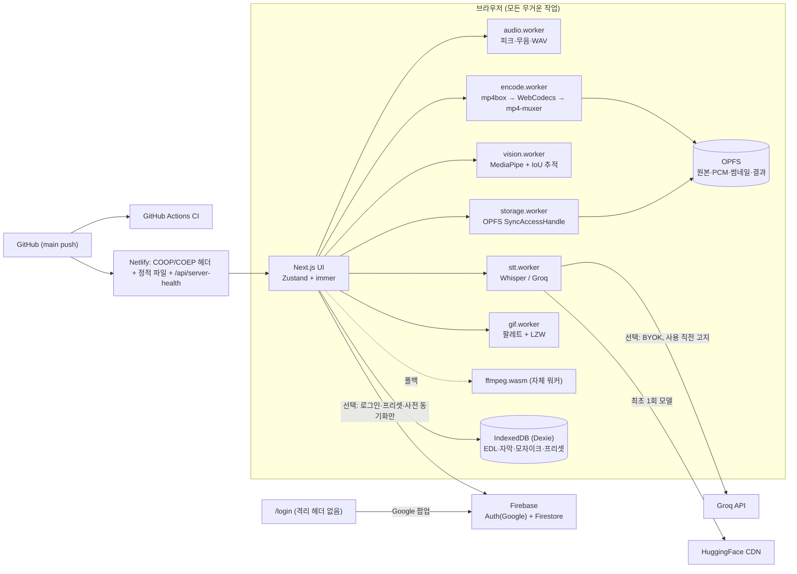

# 편집ON 기술 스택

> **한 줄 요약**: Next.js 14 UI + 워커 5종이 브라우저 안에서 영상을 디코드·분석·인코딩하고, OPFS/IndexedDB에 저장한다. 서버는 격리 헤더·정적 파일·헬스 체크만 담당하며 영상은 절대 업로드하지 않는다.
>
> **마지막 업데이트**: 2026-09-15 · 기계용 인벤토리: [`techstack.json`](./techstack.json) (설정 화면 "기술 스택"에서도 볼 수 있음)

## 1. 아키텍처

## 2. 카테고리별 구성

### 프론트엔드
| 이름 | 버전 | 용도 | 위치 | 비고 |
|---|---|---|---|---|
| Next.js App Router | 14.2 | 라우팅, 헤더 설정 | `next.config.js`, `src/app` | `output: 'export'` 아님 (헤더 필요) |
| React | 18.3 | UI | `src/components` | 컴포넌트 200줄 이하 원칙 |
| TypeScript | 5 strict | 타입 | `tsconfig.json` | `any` 금지 |
| Tailwind CSS | 3.4 | 스타일·다크 토큰 | `tailwind.config.ts`, `globals.css` | |
| Radix UI (shadcn 스타일) | 1.x | 슬라이더·탭·대화상자 | `src/components/ui` | 접근성 |
| Pretendard | variable | UI·자막 글꼴 | `public/fonts` | CDN 금지(COEP) — postinstall 복사 |

### 상태·데이터
| 이름 | 버전 | 용도 | 위치 | 비고 |
|---|---|---|---|---|
| Zustand | 4.5 | 프로젝트·타임라인·UI 스토어 | `src/store` | |
| immer | 11 | 불변 업데이트 + 되돌리기 패치 20단계 | `src/lib/core/undo.ts` | 패치만 저장해 메모리 절약 |
| Dexie | 4.4 | IndexedDB 스키마 (ERD 3장 + 프리셋) | `src/lib/storage/db.ts` | |
| OPFS | 네이티브 | 원본 사본·PCM·썸네일·결과 | `src/lib/storage/opfs.ts` | 원본 3배 여유 확인 |

### 미디어 처리 (브라우저 내)
| 이름 | 버전 | 용도 | 위치 | 비고 |
|---|---|---|---|---|
| WebCodecs | 네이티브 | 1순위 디코드·인코드 | `src/lib/encode/webcodecs/render.ts` | H.264 + AAC(없으면 Opus) |
| mp4box.js | 2.4 | MP4 디먹스 | `src/lib/encode/webcodecs/demux.ts` | 조각 단위 읽기 |
| mp4-muxer | 5.2 | MP4 먹스 | 〃 | OPFS로 스트리밍 쓰기 |
| @ffmpeg/ffmpeg + core-mt/core | 0.12 | 폴백 인코더, MP3, ASS 번인 | `src/lib/encode/ffmpeg` | 워커 파일 self-host(`public/ffmpeg/lib`). core-mt 스레드 상한(디코드 2·인코드 4) + 25초 무응답 시 단일 스레드 재시도 |
| OfflineAudioContext | 네이티브 | 모노 16kHz PCM | `src/lib/audio/decode.ts` | |
| 자체 GIF 인코더 | — | median-cut + LZW | `src/lib/gif/encoder.ts` | ffmpeg 없이 GIF |
| 자체 ZIP 작성기 | — | 사진 일괄 결과 묶기 | `src/lib/zip.ts` | STORE 방식 |

### AI·외부 API
| 이름 | 버전 | 용도 | 위치 | 비고 |
|---|---|---|---|---|
| transformers.js Whisper base (timestamped) | 3.8 | 단어 타임스탬프 STT | `src/lib/stt/localWhisper.ts` | WebGPU 우선, 30초 청크. 번들 제외 — `public/vendor/transformers` self-host 후 런타임 import (ORT의 `import.meta`가 Next 워커 청크 압축을 깨뜨림) |
| Groq whisper-large-v3-turbo | API | BYOK 고속 STT | `src/lib/stt/groq.ts` | 24MB 단위 분할 업로드 |
| MediaPipe FaceDetector | 1.0 | 얼굴 검출 | `src/lib/vision/faceDetect.ts` | 모듈 워커 로더 우회 포함 |

### 인증·CORS·호스팅·관측
| 이름 | 용도 | 위치 |
|---|---|---|
| Firebase Auth (Google 로그인) | 선택: 동기화용 로그인 (`/login`에서 팝업) | `src/lib/firebase/auth.ts`, `src/app/login` |
| Cloud Firestore + 보안 규칙 | 선택: 프리셋·추임새 사전·프로젝트 기록 동기화 (버튼을 누를 때만) | `src/lib/firebase/sync.ts`, `firestore.rules` |
| COOP same-origin / COEP credentialless | SharedArrayBuffer 활성화 (`/login`만 제외) | `next.config.js`(페이지), `netlify.toml`(정적 파일) |
| GitHub + GitHub Actions | 저장소 · 타입/린트/테스트/빌드 CI | `.github/workflows/ci.yml` |
| Netlify (Next.js 런타임) | 호스팅 + 헤더, main push 자동 배포 | `netlify.toml`, `scripts/check-deploy.mjs` |
| PWA (manifest + SW) | 오프라인 셸 | `public/sw.js` |
| `/api/server-health` + 배터리 신호등 | 서버(프로세스 RSS/메모리 한도·임시 디스크)·브라우저(저장공간·탭 메모리) 용량 경고 | `src/app/api/server-health`, `ServerBattery.tsx` |

### 테스트·빌드
| 이름 | 버전 | 용도 |
|---|---|---|
| Vitest + happy-dom + fake-indexeddb | 5.0 | 순수 로직·자막 렌더·DB 스키마 단위 테스트 (커버리지 기준 90%) |
| Playwright (Google Chrome 채널) + ffprobe | — | E2E: 편집 흐름·내보내기 결과(코덱·길이·A/V 싱크)·도구함·프로젝트 파일 |
| `scripts/copy-assets.mjs` | — | wasm·모델·폰트 self-host |

## 3. 왜 이걸 골랐나
- **브라우저 처리**: 영상을 서버로 올리면 무료 티어가 즉시 초과되고 프라이버시도 깨진다. 처리 비용을 사용자의 기기로 옮기는 것이 "0원 운영"의 유일한 방법.
- **WebCodecs 1순위 + ffmpeg 폴백**: 하드웨어 가속으로 10분 영상을 수 분 안에 처리. 코덱 지원 편차는 자동 폴백으로 흡수.
- **EDL + 원본 앵커 자막**: 파일을 자르지 않고 결정만 저장 → 되돌리기·재편집이 즉시. 자막은 원본 기준 앵커를 들고 있어 컷을 여러 번 바꿔도 누적 오차가 없다.
- **자체 GIF/ZIP**: 작은 기능 때문에 30MB wasm이나 새 의존성을 끌어오지 않기 위해.
- **immer 패치 기반 undo**: 모자이크 키프레임처럼 큰 배열이 있어도 20단계 기록이 가볍다.
- **Firebase (사용자 결정)**: Google 계정 로그인이 한 번에 되고, 동기화 데이터가 작아 무료 요금제로 충분. 문서 단위 보안 규칙으로 본인 데이터만 접근.
- **GitHub + Netlify (사용자 결정)**: push만으로 배포. Next.js 런타임을 자동 지원하고, CDN 정적 파일에 격리 헤더를 붙일 수 있다.

## 4. 외부 의존 서비스와 요금 영향
| 서비스 | 호출 시점 | 비용 | 장애 시 |
|---|---|---|---|
| HuggingFace (모델 CDN) | 자막 생성 최초 1회 (~80–150MB) | 무료 | 브라우저 캐시에 있으면 오프라인 동작, 없으면 Groq 안내 |
| Groq API | 사용자가 BYOK 엔진 선택 시 | 사용자 키의 무료 티어 | 에러 hint로 내장 엔진 안내 |
| Firebase (Auth + Firestore) | 로그인·동기화 버튼 누를 때 (선택) | Spark 무료 (문서 수·용량 매우 작음) | 로그인 없이 모든 기능 동작, 데이터는 브라우저에 남음 |
| Netlify | 페이지·wasm 전송, 헬스 API 함수 | Free(Starter) — 대역폭·빌드 시간 한도 내 | — |
| GitHub Actions | push·PR마다 CI | 공개 저장소 무료 / 비공개는 월 무료 분 한도 | 배포와 무관 (Netlify는 따로 빌드) |
| storage.googleapis.com | `npm install` 시 얼굴 모델 1회 다운로드 | 무료 | 수동 배치 안내 출력 |

## 5. 알려진 한계
- 1080p 기준 20분 정도가 현실적 상한 (브라우저 메모리). 20분 초과 시 경고.
- WebCodecs 내보내기는 MP4/MOV 원본만. WebM·MKV 원본은 ffmpeg 폴백(5~10배 느림).
- ffmpeg 폴백 + 모자이크는 3분 이하 결과물만 (구운 프레임을 wasm 메모리에 올려야 해서).
- 휴대폰 세로 영상의 회전 메타데이터(rotation matrix)는 WebCodecs 경로에서 반영하지 않음.
- BlazeFace short-range 모델은 2m 이내 얼굴에 최적 — 멀리 작은 얼굴은 놓칠 수 있어 수동 박스 제공.
- 로컬 Whisper는 30초 청크 경계에서 단어가 잘릴 수 있음.
- AAC 인코더 프라이밍 때문에 컨테이너상 오디오 길이가 영상보다 수십 ms 길게 표시됨(edit list 미기록, 싱크 오차는 100ms 이내로 검증).
- 서버 헬스의 디스크 지표는 호스트의 임시 디렉터리 기준 — 개발용 Mac에서는 실제 디스크 여유가 적으면 배터리가 주황/빨강으로 보인다.
- `/login` 페이지는 격리 헤더가 없어 그 페이지에선 고속 처리 모드가 꺼진다(로그인 전용 화면이라 영향 없음). 앱 ↔ 로그인 이동은 전체 새로고침.
- Firestore 규칙은 Java가 필요한 에뮬레이터로만 로컬 테스트 가능 — 아직 실제 프로젝트·에뮬레이터로 검증하지 않음.
- iOS Safari 편집 미지원, Firefox는 WebCodecs 부분 지원 → 폴백.
