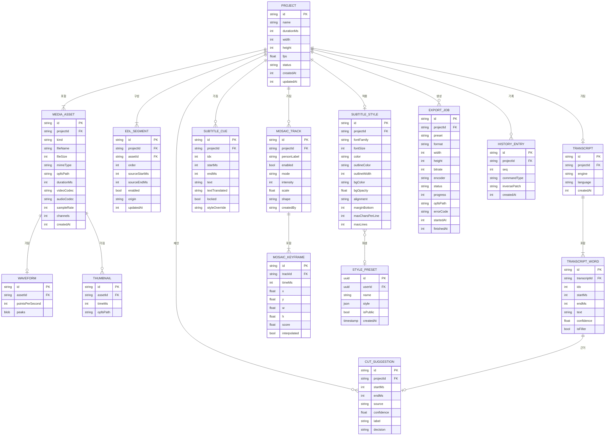

# ERD — 편집ON (EditON)

> 데이터 모델 정의서 / v1.0 / 2026-09-13
> 데이터는 세 곳에 나뉜다: **OPFS(바이너리)** · **IndexedDB(편집 데이터)** · **Firebase(계정·프리셋, 선택)**

---

## 1. 저장소 분리 원칙

| 저장소 | 담는 것 | 이유 |
|---|---|---|
| **OPFS** | 원본 영상, 썸네일, 중간 산출물, 내보내기 결과 | 수백 MB~수 GB. IndexedDB에 넣으면 느리고 터진다 |
| **IndexedDB (Dexie)** | 프로젝트 메타, EDL, 자막, 모자이크 트랙, 파형 피크 | 구조화 쿼리·인덱스 필요, 수 MB 수준 |
| **localStorage** | UI 설정, BYOK API 키, 최근 사용 프리셋 ID | 아주 작고 동기 접근 필요 |
| **Firebase (Auth + Firestore)** | 계정, 자막 스타일 프리셋, 추임새 사전, 프로젝트 메타(선택 동기화) | 기기 간 공유. **영상은 절대 올리지 않음** |

---

## 2. 전체 관계도



---

## 3. IndexedDB 스키마 (Dexie 4)

```ts
// src/lib/storage/db.ts
import Dexie, { type Table } from 'dexie';

export class EditOnDB extends Dexie {
  projects!:        Table<Project, string>;
  mediaAssets!:     Table<MediaAsset, string>;
  edlSegments!:     Table<EdlSegment, string>;
  cutSuggestions!:  Table<CutSuggestion, string>;
  transcripts!:     Table<Transcript, string>;
  transcriptWords!: Table<TranscriptWord, string>;
  subtitleCues!:    Table<SubtitleCue, string>;
  subtitleStyles!:  Table<SubtitleStyle, string>;
  mosaicTracks!:    Table<MosaicTrack, string>;
  mosaicKeyframes!: Table<MosaicKeyframe, string>;
  waveforms!:       Table<Waveform, string>;
  thumbnails!:      Table<Thumbnail, string>;
  exportJobs!:      Table<ExportJob, string>;
  history!:         Table<HistoryEntry, string>;

  constructor() {
    super('editon');
    this.version(1).stores({
      projects:        'id, updatedAt, status',
      mediaAssets:     'id, projectId, kind',
      edlSegments:     'id, projectId, [projectId+order], enabled',
      cutSuggestions:  'id, projectId, [projectId+source], startMs, decision',
      transcripts:     'id, projectId',
      transcriptWords: 'id, transcriptId, [transcriptId+idx], startMs, isFiller',
      subtitleCues:    'id, projectId, [projectId+idx], startMs',
      subtitleStyles:  'id, projectId',
      mosaicTracks:    'id, projectId, enabled',
      mosaicKeyframes: 'id, trackId, [trackId+timeMs]',
      waveforms:       'id, assetId',
      thumbnails:      'id, assetId, [assetId+timeMs]',
      exportJobs:      'id, projectId, status, startedAt',
      history:         'id, projectId, [projectId+seq]',
    });
  }
}
export const db = new EditOnDB();
```

### 3.1 타입 정의

```ts
export type ProjectStatus = 'draft' | 'editing' | 'exporting' | 'done';

export interface Project {
  id: string;                 // nanoid
  name: string;
  durationMs: number;         // EDL 적용 후 결과 길이
  sourceDurationMs: number;   // 원본 길이
  width: number;
  height: number;
  fps: number;
  status: ProjectStatus;
  createdAt: number;
  updatedAt: number;
  schemaVersion: number;      // 마이그레이션용, 현재 1
}

export interface MediaAsset {
  id: string;
  projectId: string;
  kind: 'video' | 'audio' | 'image';
  fileName: string;
  fileSize: number;
  mimeType: string;
  opfsPath: string;           // 'projects/{projectId}/source/{id}.mp4'
  durationMs: number;
  width?: number;
  height?: number;
  fps?: number;
  videoCodec?: string;        // 'avc1.42E01E'
  audioCodec?: string;        // 'mp4a.40.2'
  sampleRate?: number;
  channels?: number;
  createdAt: number;
}

/** 최종 결과물을 구성하는 "유지할 구간" 목록. 이것이 편집의 원본 진실이다. */
export interface EdlSegment {
  id: string;
  projectId: string;
  assetId: string;
  order: number;              // 0부터, 출력 순서
  sourceStartMs: number;      // 원본에서의 시작
  sourceEndMs: number;        // 원본에서의 끝
  enabled: boolean;           // false면 결과에서 제외 (삭제 대신 비활성 → 복원 가능)
  origin: 'initial' | 'manual-split' | 'auto-silence' | 'auto-filler';
  updatedAt: number;
}

/** 자동 감지 결과. 사용자가 승인해야 EDL에 반영된다. */
export interface CutSuggestion {
  id: string;
  projectId: string;
  startMs: number;            // 잘라낼 구간
  endMs: number;
  source: 'silence' | 'filler';
  confidence: number;         // 0~1
  label?: string;             // filler일 때 해당 단어 ('음')
  decision: 'pending' | 'accepted' | 'rejected';
}

export interface Transcript {
  id: string;
  projectId: string;
  engine: 'local-whisper' | 'groq' | 'gemini' | 'openai' | 'manual';
  model?: string;
  language: string;           // 'ko'
  createdAt: number;
}

export interface TranscriptWord {
  id: string;
  transcriptId: string;
  idx: number;
  startMs: number;
  endMs: number;
  text: string;
  confidence?: number;
  isFiller: boolean;
}

export interface SubtitleCue {
  id: string;
  projectId: string;
  idx: number;                // 표시 순서
  startMs: number;            // ⚠️ EDL 적용 후 "결과물 기준" 시간
  endMs: number;
  text: string;
  textTranslated?: string;
  locked: boolean;            // true면 자동 재생성 시 보존
  styleOverride?: Partial<SubtitleStyle>;  // 이 큐만 다른 스타일
}

export interface SubtitleStyle {
  id: string;
  projectId: string;
  fontFamily: string;         // 'Pretendard'
  fontSize: number;           // px, 1080p 기준
  fontWeight: number;
  color: string;              // '#FFFFFF'
  outlineColor: string;       // '#000000'
  outlineWidth: number;
  shadowBlur: number;
  bgColor: string;
  bgOpacity: number;          // 0~1
  bgPaddingX: number;
  bgPaddingY: number;
  bgRadius: number;
  alignment: 'left' | 'center' | 'right';
  verticalPosition: 'top' | 'middle' | 'bottom';
  marginBottom: number;
  maxCharsPerLine: number;    // 자동 줄바꿈 기준, 기본 24
  maxLines: number;           // 기본 2
}

export type MosaicMode = 'pixelate' | 'blur' | 'box' | 'emoji';

export interface MosaicTrack {
  id: string;
  projectId: string;
  personLabel: string;        // '인물 1'
  enabled: boolean;           // false면 이 사람은 안 가림
  mode: MosaicMode;
  intensity: number;          // pixelate: 블록 크기 / blur: 반경
  scale: number;              // bbox 확대 배율, 기본 1.2
  shape: 'rect' | 'ellipse';
  emoji?: string;
  createdBy: 'auto' | 'manual';
  startMs: number;
  endMs: number;
}

export interface MosaicKeyframe {
  id: string;
  trackId: string;
  timeMs: number;
  x: number;                  // 0~1 정규화 좌표 (해상도 변경에 안전)
  y: number;
  w: number;
  h: number;
  score: number;
  interpolated: boolean;      // true면 검출값이 아니라 보간값
}

export interface Waveform {
  id: string;
  assetId: string;
  pointsPerSecond: number;    // 100
  peaks: ArrayBuffer;         // Int8Array, -128~127로 정규화된 min/max 쌍
}

export interface Thumbnail {
  id: string;
  assetId: string;
  timeMs: number;
  opfsPath: string;
}

export interface ExportJob {
  id: string;
  projectId: string;
  preset: 'youtube-1080p' | 'youtube-720p' | 'shorts-1080x1920' | 'gif' | 'audio-only' | 'custom';
  format: 'mp4' | 'webm' | 'gif' | 'mp3';
  width: number;
  height: number;
  fps: number;
  bitrate: number;
  burnSubtitles: boolean;
  applyMosaic: boolean;
  encoder: 'webcodecs' | 'ffmpeg-wasm';
  status: 'queued' | 'running' | 'done' | 'failed' | 'aborted';
  progress: number;           // 0~100
  opfsPath?: string;
  errorCode?: string;
  startedAt: number;
  finishedAt?: number;
}

export interface HistoryEntry {
  id: string;
  projectId: string;
  seq: number;
  commandType: string;        // 'SPLIT_SEGMENT' | 'ACCEPT_SUGGESTIONS' | ...
  inversePatch: string;       // JSON, 되돌리기용 역연산
  createdAt: number;
}
```

---

## 4. OPFS 디렉터리 구조

```
/ (origin private root)
└── projects/
    └── {projectId}/
        ├── source/
        │   ├── {assetId}.mp4          원본 (읽기 전용으로만 접근)
        │   └── {assetId}.pcm          디코드된 오디오 캐시 (Float32)
        ├── thumbs/
        │   ├── 000000.webp            timeMs를 6자리로 패딩
        │   ├── 001000.webp
        │   └── ...
        ├── temp/
        │   └── {jobId}/               내보내기 중간 산출물, 완료 후 삭제
        └── exports/
            └── {jobId}.mp4
```

**용량 관리 규칙**
- 앱 시작 시 `navigator.storage.estimate()`로 여유 확인. 남은 공간 < 원본 크기 × 3이면 경고.
- `temp/`는 job 종료 시 무조건 삭제.
- 30일 이상 열지 않은 프로젝트는 설정 화면에서 "정리하기" 대상으로 표시(자동 삭제는 하지 않음).
- 프로젝트 삭제 시 IndexedDB 레코드와 OPFS 디렉터리를 **트랜잭션처럼** 함께 지운다. 실패 시 orphan 스캔으로 정리.

---

## 5. Firebase 데이터 구조 (선택 기능)

> 2026-09-15 Supabase(Postgres)에서 **Firebase Auth(Google 로그인) + Cloud Firestore**로 전환했다.
> 규칙 원본: 저장소 루트 `firestore.rules` · 인덱스 `firestore.indexes.json` · Storage 전면 거부 `storage.rules` · 코드 `src/lib/firebase/`

```
users/{uid}                                  프로필
  displayName, email, photoURL, createdAt, lastLoginAt

users/{uid}/stylePresets/{presetId}          자막 스타일 프리셋 (기기 간 동기화 + 공개 공유 대비)
  name(≤60자), style(map — SubtitleStyle에서 id/projectId 제외), isPublic(bool), updatedAtMs(number), schemaVersion(int)

users/{uid}/fillerDictionaries/{language}    추임새 사전 (문서 id = 'ko' 등 언어 코드)
  language, words([{ word, enabled }] ≤500개), updatedAtMs

users/{uid}/projectMeta/{localProjectId}     "이 기기에 이런 프로젝트가 있었다" 기록 — 영상 없음
  localId, name(≤200자), durationMs, sourceDurationMs, deviceLabel(≤60자), updatedAtMs
```

| 이전 Supabase 테이블 | Firestore 경로 | 비고 |
|---|---|---|
| profiles | `users/{uid}` | Auth uid가 문서 id |
| style_presets | `users/{uid}/stylePresets/{id}` | `use_count`는 공개 공유 기능을 만들 때 추가 |
| project_meta | `users/{uid}/projectMeta/{localId}` | (user, local_id) 유일성은 경로가 보장 |
| filler_dictionaries | `users/{uid}/fillerDictionaries/{language}` | (user, language) 유일성은 경로가 보장 |

### 5.1 보안 규칙 요약 (RLS 대체)
- 모든 문서는 `request.auth.uid == uid`인 본인만 읽기·쓰기·삭제
- 쓰기 시 허용 필드만(`keys().hasOnly`) + 타입·길이 검사 → 영상 같은 큰 데이터가 끼어들 수 없다
- 공개 프리셋: 컬렉션 그룹 `stylePresets` 중 `isPublic == true`만 로그인 사용자에게 읽기 허용 (인덱스 포함)
- 규칙에 없는 경로는 전부 거부. **규칙을 배포하지 않으면 동기화가 permission-denied로 실패한다**

### 5.2 동기화 규칙
- 로컬(IndexedDB·localStorage)이 기준. 설정 화면에서 사용자가 버튼을 누를 때만 동기화한다(자동 업로드 없음)
- 충돌은 `updatedAtMs`가 더 최근인 쪽이 이긴다. 서버에서 사라진 로컬 프리셋은 유실을 피하려고 다시 올린다 → 로컬에서 지울 때 서버 문서도 함께 지운다
- 원격 데이터는 읽을 때 `src/lib/firebase/schema.ts`에서 필드별로 검증한다(틀린 값은 기본값)

**Firebase Storage는 사용하지 않는다** (`storage.rules`로 전부 거부). 영상을 담는 순간 "무료·프라이버시" 전제가 깨진다.

---

## 6. 데이터 규칙

### 6.1 시간 단위
- 저장·계산은 **전부 밀리초 정수(ms)**. 부동소수 초 단위는 누적 오차를 만든다.
- UI 표시만 `HH:MM:SS.mmm`으로 변환.
- 프레임 스냅이 필요할 때만 `Math.round(ms * fps / 1000)`로 프레임 인덱스 계산.

### 6.2 좌표 단위
- 모자이크 bbox는 **0~1 정규화 좌표**. 720p로 내보내든 1080p로 내보내든 그대로 쓸 수 있다.

### 6.3 자막 시간축 (가장 헷갈리는 부분)
- `TranscriptWord.startMs` → **원본 영상 기준**
- `SubtitleCue.startMs` → **EDL 적용 후 결과물 기준**

컷 편집이 바뀌면 자막 시간을 다시 매핑해야 한다.
```ts
/** 원본 시간 → 결과물 시간. 잘려나간 구간이면 null. */
function sourceToOutput(sourceMs: number, edl: EdlSegment[]): number | null {
  let acc = 0;
  for (const seg of edl.filter(s => s.enabled).sort((a, b) => a.order - b.order)) {
    if (sourceMs < seg.sourceStartMs) return null;         // 잘린 구간
    if (sourceMs <= seg.sourceEndMs) return acc + (sourceMs - seg.sourceStartMs);
    acc += seg.sourceEndMs - seg.sourceStartMs;
  }
  return null;
}
```
이 함수는 `lib/core/edl.ts`에 두고 **단위 테스트를 가장 촘촘히** 짜야 한다. 여기가 틀어지면 자막이 전부 어긋난다.

### 6.4 마이그레이션
`Project.schemaVersion`을 두고, 앱 시작 시 버전이 낮은 프로젝트는 마이그레이션 함수를 통과시킨다. Dexie `version(n).upgrade()`도 병행.

### 6.5 프로젝트 파일 내보내기 (.editon.json)
```jsonc
{
  "format": "editon-project",
  "version": 1,
  "project":        { /* Project */ },
  "assets":         [ /* MediaAsset — opfsPath 대신 fileName·fileSize·해시만 */ ],
  "edlSegments":    [ /* ... */ ],
  "subtitleCues":   [ /* ... */ ],
  "subtitleStyle":  { /* ... */ },
  "mosaicTracks":   [ { "track": {}, "keyframes": [] } ]
}
```
영상 파일은 포함하지 않는다. 불러올 때 "원본 파일을 다시 선택해 주세요"로 재연결하고, 파일 크기·길이로 동일 파일인지 확인한다.
